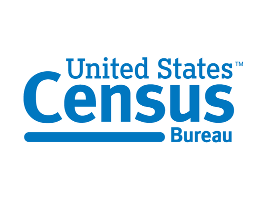

# Course Title

> Your name and affiliation (company, agency, university, etc.)

## Summary

Give a brief summary of your course and what students can expect to learn. Mention which datasets and tools you'll be using.

Want an example for what your course writeup should look like? See our [sample course writeup](../sample/README.md).

## Why this course?

Explain briefly why this course is important for Census customers.

--------------------------------------------------------------------------------

## Video 1: Video Name

_Approximate video length, in minutes_

### Video Description

Provide a short, paragraph-long description for the video. We'll use this in the description of your video on YouTube.

### Script

In this script section, write what the video narrator would be saying.

_Indicate "stage directions" in italics, like this. For instance, you can indicate clicking on things (if it's not obvious from the script), opening apps or files, or displaying certain graphics._

Feel free to include pictures or screenshots in the script to clarify what the narrator should be doing.

### Video Format

The Census Bureau can produce videos in a variety of formats. Mention which format you would prefer, and provide any supplemental materials in this section. Options include:

* **A narrator voicing over a screen capture**. That is, someone talking over a recorded laptop screen. In this case, the narrator will talk following the script and take actions on their computer based on the instructions provided in the script.
* **A narrator talking over slides**. In this case, please attach a PowerPoint file to your GitHub issue, or link to a public Google Slides presentation here. In the script, indicate when the narrator should move to the next slide.
* **A "talking head"**. We can record someone speaking in front of a Census-branded background, optionally with a lower third. [Here's an example](https://www.youtube.com/watch?v=dKNJpcJKYAE).

### Additional Resources

Here you can link to a thumbnail image you'd like us to use, datasets that might be useful when we're producing the video, a translated transcript, or other materials that may be useful.

--------------------------------------------------------------------------------

## Video 2: Video Name

> Follow the format described above for every video!
